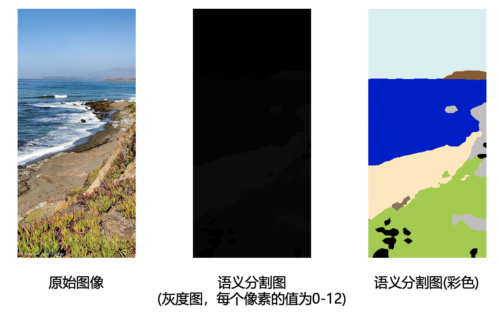
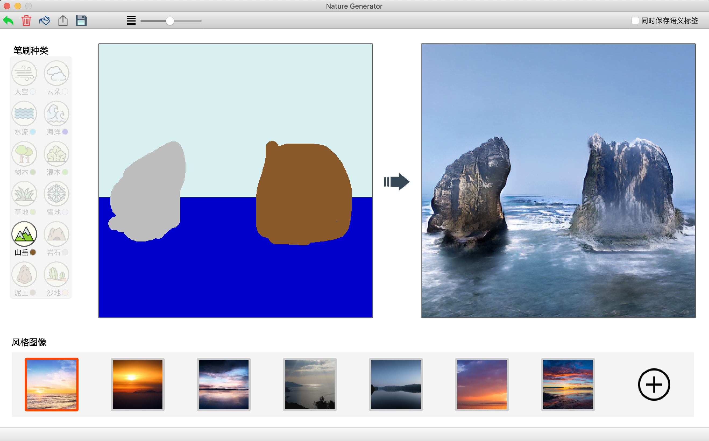

# 说明文档


## 项目介绍

本项目实现了[spade模型](https://github.com/NVlabs/SPADE)，并且在自定义的数据集上训练，并且在自定义的数据集上训练，得到可以生成风景图像的模型，并提供了交互界面。各个文件夹作用如下：

| 文件夹名称         | 说明                                         |
| ------------------ | -------------------------------------------- |
| **flickr_scraper** | 从FLickr网站上爬取风景图像文件的爬虫模块     |
| **spade**          | 模型架构的代码，以及训练后权重文件的保存处   |
| **spadeui**        | 交互界面代码                                 |
| *IMAGES*           | 包含了一些示例图片，可以用来检验模型生成效果 |


## 数据集准备

所有数据集中，png文件为语义分割图，jpg文件为原始图像

- **ADE20K 数据集**. ADE20K数据集可以从 [MIT官网](http://data.csail.mit.edu/places/ADEchallenge/ADEChallengeData2016.zip) 下载. 在下载并解压后，将 `ADEChallengeData2016/images/`中的JPG文件 `ADEChallengeData2016/annotatoins/`中的PNG文件放在同一目录下。数据集中各个标签的介绍参见 `objectInfo150.txt` 和 `sceneCategories.txt` 文件。
- **Flickr 数据集**. 自定义的Flickr数据集可以从 [百度网盘](https://pan.baidu.com/s/1Q4jQuFxVgjtybqkGyKXnEQ) 下载，密码「rlti」。 在下载并解压后，将 `images/`中的JPG文件 `labels/`中的PNG文件放在同一目录下。Flickr数据集各个标签的信息如下所示。

| 标签名称        | 标签ID| 在语义分割图中的颜色 |
| --------------- | ---- | ------ |
| 不在意其内容 unknown | 0    | 黑色   |
| 天空 sky        | 1    | 天蓝色 |
| 云朵 cloud      | 2    | 白色   |
| 水流 water      | 3    | 淡蓝色 |
| 海洋 sea        | 4    | 深蓝色 |
| 树木 tree       | 5    | 深绿色 |
| 灌木 bush       | 6    | 绿色   |
| 草地 grass      | 7    | 草绿色 |
| 雪地 snow       | 8    | 淡紫色 |
| 山岳 moun- tain | 9    | 深褐色 |
| 岩石 rock       | 10   | 灰色   |
| 泥土 earth      | 11   | 淡褐色 |
| 沙地 sand       | 12   | 淡黄色 |

原始的语义分割图是一张灰度图，其每一个像素的值对应了原始图像同样位置的像素所属物体的标签ID；训练时使用原始的语义分割图，而为了可视化需要，在交互界面中使用彩色语义分割图，每一个像素的值对应不同的颜色；在生成图像时先把彩色的语义分割图转成原始的灰度图，在使用模型进行生成。一个对比如下：



## 代码结构

和网络架构相关的spade文件夹下各个模型的功能如下所示。

- `train.py, test.py`：训练和测试的入口
- `checkpoints (数据)`：保存了训练时生成模型
- `dataloader (代码)`：数据集对应的类文件和dataloader文件
- `dataset (数据)`：存放数据集的文件夹
- `images (数据)`：保存训练时生成的图像
- **`models (代码)`**：模型的架构相关的文件，核心部分
- `options (代码)`：训练和测试时的配置信息
- `sync_batchnorm (代码)`：sync_batchnorm的实现，因为没有那个项目做成依赖所以只好复制代码
- `trainers (代码)`：管理训练时的一些功能
- `util (代码)`：一些工具方法


## 运行

### 安装依赖

本项目需要 PyTorch 1.0 和Python3。在根目录下执行如下命令以安装依赖，需要安装的依赖的信息在 `requirements.txt` 中。

```bash
pip install -r requirements.txt
```


### 模型训练

在数据集下载完成后，假设数据集所在文件夹放到 `./spade/dataset/` 目录下，和该目录下已有的 `ADEChallengeData2016` 文件夹并列。之后可以在根目录下运行如下命令开始训练。

```bash
python -m spade.train --dataset ade20k --is_train 
```

其中 `--dataset` 参数表明了数据集的名称，这也是数据集所在文件夹的名称；`--is_train`表示进行训练。命令行的更多配置项参考 `./spade/options/train_options.py`。

数据集训练得到的模型保存在 `./spade/checkpoints/` 文件夹下。，运行过程中生成的图像保存在 `./spade/images/` 文件夹下。


### 模型测试

发送项目代码的邮件同时发送了 `训练好的模型.zip` 这一压缩包，该压缩包中存放了训练好的Flickr数据集的模型。将解压得到的 `natural` 文件夹放到 `./spade/checkpoints/` 文件夹下，可以使用训练好的基于Flickr数据集的模型进行图像生成。

在生成过程中，可以选择使用彩色的语义分割图或者使用原始的灰度语义分割图。相关的语义分割图全部位于 `./IMAGES` 文件夹下，其中：

-  `style.png` 为使用的风格图像；
- 彩色的语义分割图和灰度语义分割图分别有四张且按照序号一一对应，例如 `colorlabel1.png` 和 `greylabel1.png` 表示的是相同的分割内容
- `result1.png` 到 `result4.png` 则是4种分割图对应的生成结果。

**使用彩色的语义分割图进行测试：**

```bash
python -m spade.test --dataset natural --style_path ./IMAGES/style.png --label_path ./IMAGES/colorlabel1.png --result_path ./IMAGES/result1.png
```
**使用原始的灰度语义分割图进行测试**

```bash
python -m spade.test --dataset natural --style_path ./IMAGES/style.png --label_path ./IMAGES/greylabel1.png --result_path ./IMAGES/result1.png --use_greylabel 
```

其中 `--use_greylabel` 表明使用的是灰度语义分割图，更多配置信息见 `./spade/options/test_options.py`。


### 交互界面示例

在安装了 PyQt5 框架后可以在根目录下使用如下命令启动GUI：

```bash
python run_gui.py
```

交互界面的运行截图如下所示，具体的信息参见论文：




